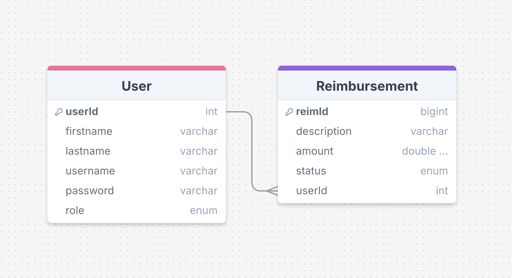

## ERS

Simple employee reimbursement system app that let employee create the reimbursement for manager to approve and deny. 

### Tech Stack Used
#### Frontened 
- React - building user interface and managing component-based view
- React router - for routing through different page in application
- Mui - for modern and pre-built components
- Typescript - to ensure type safety
- Exios - for making API requests 

#### Backend
- Spring Boot
- PostgreSQL - rational database to store the user and reimbursement data
- JWT - secure authentication and authorization

### ERD Model

### Challenges
- API Error Handling: Ensuring robust error handling for various API scenarios.
    Solution: Implemented try-catch blocks and error messages to improve user feedback.

### Future Enhancements
- Mobile-Responsive Design: Optimize the UI for better usability on mobile devices.
- Able to edit the reimbursement after created.
- Manager able to promote the Employee to manager
